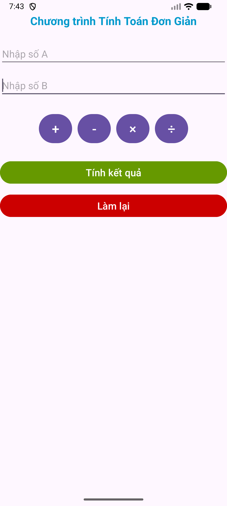
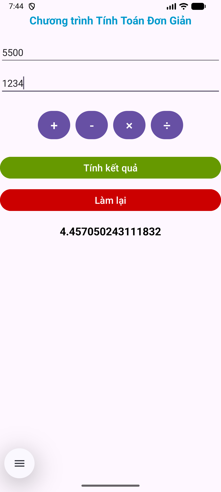
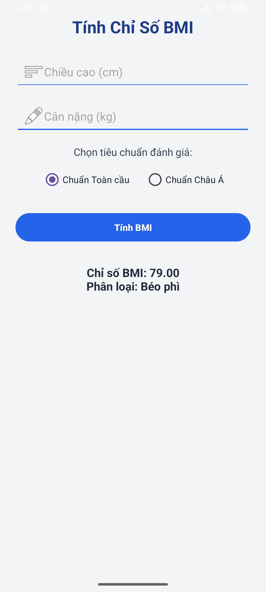
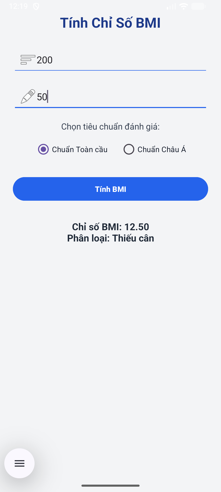
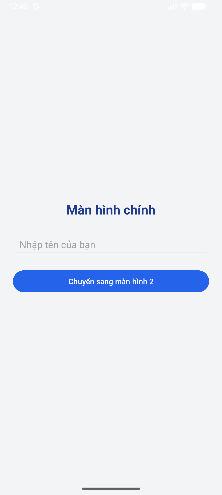
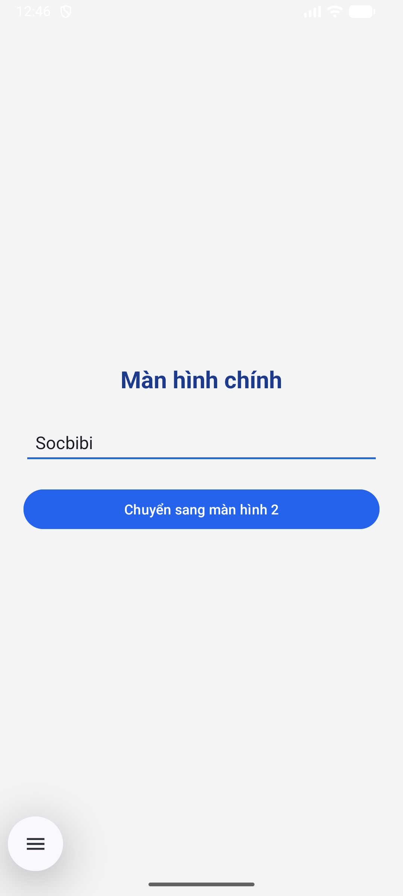

# 📚 BÀI TẬP ANDROID – Nguyễn Gia Khiêm

> Tổng hợp các bài thực hành trong môn **Lập trình Giao diện Cơ Bản (Basic GUI Programming)**.  
> Mỗi bài được xây dựng bằng **Java + Android Studio**, kèm theo README mô tả chi tiết.

---

## 🔗 Danh sách bài tập

| # | Bài thực hành |
|:-:|----------------|
🧮 Ứng dụng **Tính Toán Đơn Giản** | [Xem chi tiết](./TH_Bai1_SimpleMath/README.md) |
⚖️ Ứng dụng **Tính Chỉ Số BMI (Basic GUI)** | [Xem chi tiết](./TH_Bai2_BasicGUI/README.md) |
🔄 **Chuyển Màn Hình & Fragment** | [Xem chi tiết](./TH_Bai3_Chuyenmanhinh_Fragment2/README.md) |
👤 **Giao Diện Hồ Sơ (Layout Simple 2)** | [Xem chi tiết](./TH_Layout_Simple2/README.md) |
🔐 **Màn Hình Đăng Ký (Layout Simple Login)** | [Xem chi tiết](./TH_Layout_SimpleLogin/README.md) |

---

## 🖼️ Giao diện minh họa

### 🧮 TH_Bai1_SimpleMath  

---

### ⚖️ TH_Bai2_BasicGUI  

---

### 🔄 TH_Bai3_Chuyenmanhinh_Fragment2  

---

### 👤 TH_Layout_Simple2  

---

### 🔐 TH_Layout_SimpleLogin  

---

## 👨‍💻 Tác giả

**Họ tên:** Nguyễn Gia Khiêm  
**Lớp:** 65.CNTT_CLC  
**Trường:** Đại học Nha Trang  
**Email:** gk699488@gmail.com  

