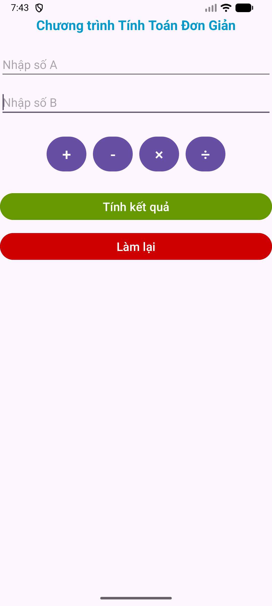
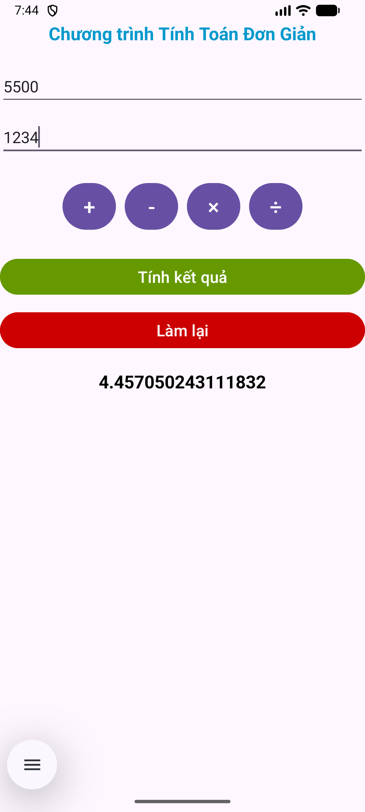

# 🧮 Ứng dụng Tính Toán Đơn Giản (Simple Math)

## 📘 Giới thiệu
**Simple Math** là một ứng dụng Android đơn giản giúp người dùng thực hiện các phép tính cơ bản như:
- Cộng (`+`)
- Trừ (`-`)
- Nhân (`×`)
- Chia (`÷`)

Ứng dụng được viết bằng **Java** trong **Android Studio**, phù hợp cho sinh viên hoặc người mới học lập trình Android muốn tìm hiểu:
- Cách xử lý sự kiện (Event Handling)
- Cách tương tác với các thành phần giao diện (`EditText`, `Button`, `TextView`)
- Cách hiển thị thông báo (`Toast`) và xử lý lỗi nhập liệu

---

## 🚀 Tính năng chính
✅ Nhập hai số A và B  
✅ Chọn phép toán muốn thực hiện  
✅ Nhấn “**Tính kết quả**” để xem kết quả ngay lập tức  
✅ Thông báo lỗi nếu chia cho 0 hoặc nhập sai định dạng  
✅ Nút “**Làm lại**” để xóa toàn bộ dữ liệu và tính toán lại  

---

## 🖼️ Giao diện ứng dụng

### 🔹 Trước khi tính toán

### 🔹 Sau khi tính toán

---

## 🧩 Cấu trúc dự án
