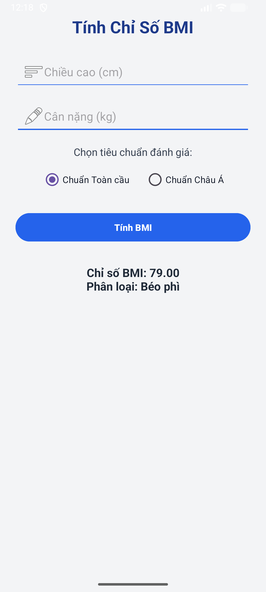

# 🧍‍♀️ Ứng dụng Tính Chỉ Số BMI (TH_Bai2_BasicGUI)

Một ứng dụng Android được xây dựng bằng **Java** trên **Android Studio**, giúp người dùng tính toán **chỉ số BMI (Body Mass Index)** và hiển thị **phân loại sức khỏe** theo hai tiêu chuẩn:  
- **Chuẩn Toàn cầu (Global Standard)**  
- **Chuẩn Châu Á (Asian Standard)**

Ứng dụng này được phát triển trong bài thực hành **TH_Bài 2 – Basic GUI Programming**, nhằm rèn luyện kỹ năng thiết kế giao diện, xử lý sự kiện, và viết logic điều kiện trong Android.

---

## 🚀 Tính năng chính

✅ Nhập **chiều cao (cm)** và **cân nặng (kg)**  
✅ Chọn tiêu chuẩn đánh giá: **Toàn cầu** hoặc **Châu Á**  
✅ Nhấn **Tính BMI** để xem kết quả  
✅ Hiển thị **chỉ số BMI** và **phân loại sức khỏe tương ứng**  
✅ Giao diện tiếng Việt thân thiện, dễ hiểu, phù hợp người mới học Android  
✅ Sử dụng hoàn toàn bằng **Java** và **XML Layout**

---

## 🖼️ Giao diện ban đầu

## 🖼️ Giao diện lúc sau

---

## 🧩 Cấu trúc dự án

app/
├── java/
│ └── com.example.bmi_basicgui/
│ └── MainActivity.java
└── res/
├── layout/
│ └── activity_main.xml
├── mipmap/
└── values/
├── colors.xml
├── strings.xml
└── styles.xml

---

## ⚙️ Cách sử dụng

1. **Nhập chiều cao** (tính bằng cm)  
2. **Nhập cân nặng** (tính bằng kg)  
3. Chọn **tiêu chuẩn đánh giá** (Toàn cầu / Châu Á)  
4. Nhấn **Tính BMI** để xem kết quả  
5. Ứng dụng sẽ hiển thị:
   - **Chỉ số BMI** (số thập phân 2 chữ số)
   - **Phân loại sức khỏe** (Thiếu cân, Bình thường, Thừa cân, Béo phì)

---

## 🧠 Kiến thức áp dụng

| Thành phần | Mục đích |
|-------------|----------|
| `EditText` | Nhập chiều cao và cân nặng |
| `RadioGroup`, `RadioButton` | Chọn tiêu chuẩn đánh giá |
| `Button` | Bắt sự kiện tính toán |
| `TextView` | Hiển thị kết quả |
| `OnClickListener` | Xử lý sự kiện bấm nút |
| `if-else` | Logic phân loại sức khỏe |
| `Toast` | Thông báo lỗi khi thiếu dữ liệu |

---

## 💡 Bảng phân loại BMI (theo WHO)

| Phân loại | BMI (kg/m²) – Toàn cầu | BMI (kg/m²) – Châu Á |
|------------|------------------------|----------------------|
| Thiếu cân | < 18.5 | < 18.5 |
| Bình thường | 18.5 – 24.9 | 18.5 – 22.9 |
| Thừa cân | 25.0 – 29.9 | 23.0 – 24.9 |
| Béo phì | ≥ 30.0 | ≥ 25.0 |

---

## ✨ Mục tiêu bài học

- Thiết kế giao diện người dùng bằng **XML**  
- Xử lý sự kiện với **OnClickListener**  
- Áp dụng **điều kiện (if-else)** trong Java  
- Hiển thị thông tin kết quả trên **TextView**  
- Làm quen với chuẩn thiết kế **Material Design đơn giản**

---

## 👨‍💻 Tác giả

**Tên sinh viên:** [Nguyễn Gia Khiêm]  
**Lớp:** [65.CNTT_CLC]  
**Trường:** [Đại học Nha Trang]  
**Email:** [gk699488@gmail.com]

---

> 🧡 *Nếu bạn thấy dự án này hữu ích, hãy ⭐ (Star) repo trên GitHub để ủng hộ nhé!*
