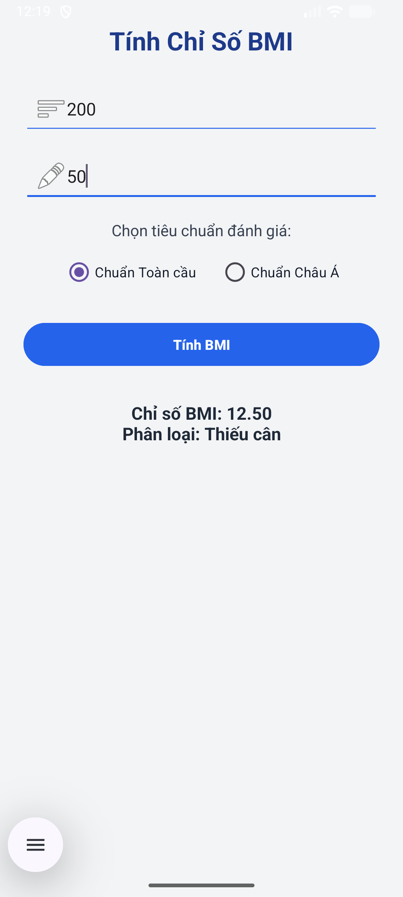

# 🧍‍♀️ Ứng dụng Tính Chỉ Số BMI (TH_Bai2_BasicGUI)

Một ứng dụng Android được xây dựng bằng **Java** trên **Android Studio**, giúp người dùng tính toán **chỉ số BMI (Body Mass Index)** và hiển thị **phân loại sức khỏe** theo hai tiêu chuẩn:  
- **Chuẩn Toàn cầu (Global Standard)**  
- **Chuẩn Châu Á (Asian Standard)**

Ứng dụng này được phát triển trong bài thực hành **TH_Bài 2 – Basic GUI Programming**, nhằm rèn luyện kỹ năng thiết kế giao diện, xử lý sự kiện, và viết logic điều kiện trong Android.

---

## 🚀 Tính năng chính

✅ Nhập **chiều cao (cm)** và **cân nặng (kg)**  
✅ Chọn tiêu chuẩn đánh giá: **Toàn cầu** hoặc **Châu Á**  
✅ Nhấn **Tính BMI** để xem kết quả  
✅ Hiển thị **chỉ số BMI** và **phân loại sức khỏe tương ứng**  
✅ Giao diện tiếng Việt thân thiện, dễ hiểu, phù hợp người mới học Android  
✅ Sử dụng hoàn toàn bằng **Java** và **XML Layout**

---

## 🖼️ Giao diện ban đầu

## 🖼️ Giao diện lúc sau

---

## 🧩 Cấu trúc dự án

